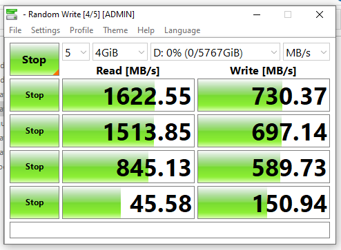

# Creating Tiered Storage in Windows 10

## Why do this?

 Tiering is typically only accessable through the Windows Server Storage Spaces UI but is fully funtional using Windows 10 via it's powershell modules. This allows desktop users to utilse an SSD as a cache for a much larger drive. Storage spaces will automatcially determine what kind of cache type it will utilise when made. Details about which type of cache will be used can be found here:



Write speeds will be significantly increased for HDDs **UP TO THE SIZE OF YOUR CACHE DRIVE**. Once the cache is full it will take some time to write to disk.

I've found this is great to boost performance when gaming vs using the raw HDD alone; let me know how you get on! 

**Warning: Should the SSD fail, any data on it that has yet to be written to the HDD will be lost. You can use multiple SSDs as redundent cache to accomodate this, however, I'll leave that as an exercise to the reader. Happy to help on twitter \(top bar\) if you need a hand.** 

## Benchmarks

### 6TB WD Elements shucked drive stats


### 6TB WD Elements shucked drive + 256GB NVMe cache stats




## Steps

### Check disks show up

```text
#List disks
Get-PhysicalDisks
```

If disks are listed as "can pool" = False, use diskpart to clear formatting. Even if the disk appears empty, but diskpart has a \* in GPT, it will show up as "Can Pool" = False. A restart may be needed.

### Add the all the disks to be included in the virtual disk into a Storage Pool.

Via GUI:

```text
Access "Storage Spaces" > Create new pool > 
>select disks to be included > next. 
Before setting up a virtual disk, exit the page. 
```

Or via Powershell:

```text
$storagesysfriendly = Get-StorageSubsystem
$disks = Get-PhysicalDisk |? {$_.CanPool -eq $true}
$StoragePoolName = "StoragePool1" 
New-StoragePool -StorageSubSystemFriendlyName $storagesysfriendly -FriendlyName $StoragePoolName -PhysicalDisks $disks
```

### View disks in storage pool

```text
Get-StoragePool 
Get-StoragePool -FriendlyName $StoragePoolName | Get-PhysicalDisk | Select FriendlyName, MediaType
```

### Define the two tiers and add relevant drives to each

```text
$SSDTierName = "SSDT"
$HDDTierName = "HDDT"
$SSDTier = New-StorageTier -StoragePoolFriendlyName $StoragePoolName -FriendlyName $SSDTierName -MediaType SSD
$HDDTier = New-StorageTier -StoragePoolFriendlyName $StoragePoolName -FriendlyName $HDDTierName -MediaType HDD
```

### Get total size of each tier

```text
$DriveTierResiliency = "Simple"
if ($SSDTierSize -eq $null){
    $SSDTierSize = (Get-StorageTierSupportedSize -FriendlyName $SSDTierName -ResiliencySettingName $DriveTierResiliency).TierSizeMax
    $SSDTierSize = [int64]($SSDTierSize * $UsableSpace)
}
if ($HDDTierSize -eq $null){
    $HDDTierSize = (Get-StorageTierSupportedSize -FriendlyName $HDDTierName -ResiliencySettingName $DriveTierResiliency).TierSizeMax 
    $HDDTierSize = [int64]($HDDTierSize * $UsableSpace)
}
Write-Output "TierSizes: ( $SSDTierSize , $HDDTierSize )"
```

### Create virtual disk \(unformated\)

```text
$TieredDriveLetter = "F"
$TieredDiskName = "TieredDisk"
New-VirtualDisk -StoragePoolFriendlyName $StoragePoolName -FriendlyName $TieredDiskName -StorageTiers @($SSDTier, $HDDTier) -StorageTierSizes @($SSDTierSize, $HDDTierSize) -ResiliencySettingName $DriveTierResiliency -AutoWriteCacheSize -AutoNumberOfColumns
```

### Format as GPT

```text
Get-VirtualDisk $TieredDiskName | Get-Disk | Initialize-Disk -PartitionStyle GPT
```

### Create usable partition

```text
Get-VirtualDisk $TieredDiskName | Get-Disk | New-Partition -DriveLetter $TieredDriveLetter -UseMaximumSize
```

### Initialise and print details

```text
Initialize-Volume -DriveLetter $TieredDriveLetter -FileSystem NTFS -Confirm:$false -NewFileSystemLabel $TieredDriveLabel
Get-Volume -DriveLetter $TieredDriveLetter
```


References:






